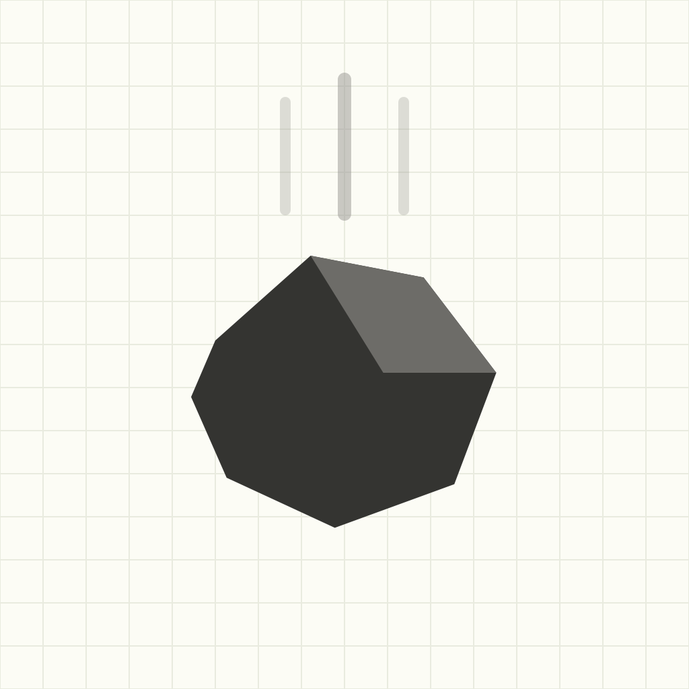

# Plummet

A playful native-iOS kinematics solver. Throw something off a building, time the fall, learn how high it was — and see every equation behind the answer.



## What it does

One screen, styled like a physicist's graph-paper field notebook. Five kinematics variables:

| Symbol | Meaning | Unit |
|--------|---------|------|
| `s`  | displacement / height | m |
| `v₀` | initial velocity | m/s |
| `v`  | final velocity | m/s |
| `a`  | acceleration (prefilled −9.81) | m/s² |
| `t`  | time | s |

Fill in any **three** and Plummet solves the rest instantly. A stopwatch at the bottom times a real fall — press stop and the elapsed time drops into the time field, solving the page for you. Tap any solved value to expand the full worked steps: the equation, your numbers plugged in, and the result. Heights are also shown in feet and as "≈ N floors."

- **Sign convention:** up is positive (`a = −9.81`); the height readout uses the magnitude, so a fall always reads as a positive height.
- **Handles** drops, throws up/down, apex, two-solution cases (an object passing a height twice), and flags contradictory over-input instead of lying.

## Architecture

Three layers with clean boundaries:

- **`KinematicsSolver`** — a pure Swift value type (Foundation only, no UI). Closed-form suvat solver with worked-step records.
- **`SolverState`** — a Combine `ObservableObject` view model: field values, user-vs-solved tracking, the stopwatch, and live re-solving.
- **SwiftUI views** — the graph-paper notebook screen, field rows with expandable worked steps, and the stopwatch bar.

The pure files (`KinematicsSolver.swift`, `Formatting.swift`, `SolverState.swift`) are compiled into **both** the iOS app and a SwiftPM library, so the unit tests run on macOS via `swift test` — no simulator required.

## Build & test

```bash
# Unit tests (macOS, no simulator needed)
swift test

# Build the app for the simulator
xcodebuild -project Plummet.xcodeproj -target Plummet -sdk iphonesimulator26.4 -configuration Debug build
```

Requires Xcode 26+. iOS 17+, iPhone portrait. No third-party dependencies.

## Docs

- Design spec: [`docs/superpowers/specs`](docs/superpowers/specs)
- Implementation plan: [`docs/superpowers/plans`](docs/superpowers/plans)

## The app icon

Rendered from source by [`tools/render_icon.swift`](tools/render_icon.swift) (native AppKit, no dependencies): a minimal dark faceted rock mid-plummet with motion streaks, on the notebook cream.
